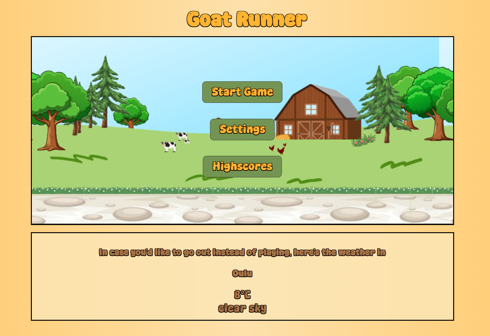

# Web_Game (+ Open source weather)

## Description
This is a browser-based web game developed as part of the Web Application Basics -course. 

The project is built using HTML, JavaScript and CSS. The goal was to create a simple, functional game. The game is farm-style endless runner game where the player avoids obstacles and collects points. 

The game combines gameplay, scoring and sounds with settings. It has a localStorage for highscores. The project implements OOP (object-oriented programming). 

In addition, the project includes a weather feature that uses the OpenWeather API to display real-time weather in Oulu.

## Gameplay Preview

## How to play
Use SPACE-button to jump over the obstacles. 
The game will get more hard 400 points as the minimum and maximum distance between obstacles decreases. Also the speed of obstacles grow with same rules.

## Instructors for OpenWeather
If you'd like to use opensource weather on app, you need api key. Instructors for Opensource:

**1. In root folder (Web_Game) , add file .env and add line**
	OPENWEATHER_API_KEY=YOUR_KEY

**2. In terminal run**

npm install express dotenv node-fetch@2

**3. Start the backend in terminal with**

node server.js

**4. Open the websites in url http://localhost:3000**

Note that if you open the app just clicking the index-file, weather will not be shown because the backend isn't running. 